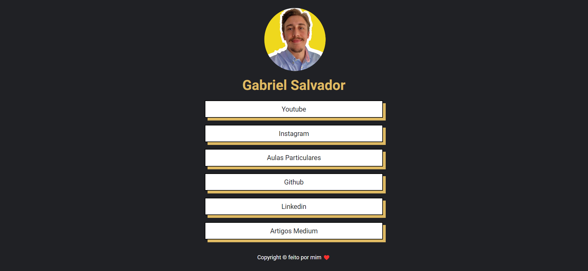

<h1 align="center"><a href="https://profgabrielsalvador.com.br/">Meu Portfolio</a></h1>

Nesse projeto bem simples criei meu portfolio em um conceito minimalista aonde contém uma árvore de links que te leva para várias redes e conteúdos variados, utilizei html e scss para ficar o mais leve possível.

<h4 align="center"> 
	🚧  Meu portfolio 🚀 Concluído  🚧
</h4>

# Clone este repositório

$ git clone <https://github.com/gabrielss97/portifolio-Gabriel-Salvador.git>

# Vá para a pasta portfolio

$ cd portfolio

# Execute a aplicação pelo live-server

Instale a extensão Live-server e depois clique no botão inferior direito Go Live

### Autor

---

<a href="http://profgabrielsalvador.com.br/">
 
  
 <b>Gabriel Salvador</b></a> <a href="http://profgabrielsalvador.com.br/" title="Rocketseat">🚀</a>

Feito com ❤️ por Gabriel Salvador 👋🏽 Entre em contato!

